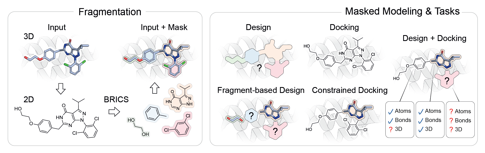
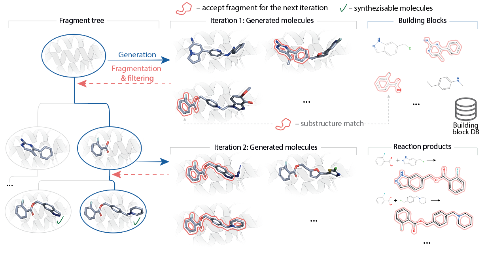

# Large Drug Discovery Model (LDDM)



Official code repository for "A Unified 3D Generative Model for Synthesizable Structure-Based Drug Design".
LDDM is a pocket-conditioned generative model that supports a broad range of molecular modeling tasks within a single model:
- De novo design
- Fragment growing
- Fragment linking
- Docking
- Partial docking (e.g. for covalent ligands)
- Locally programmable design
- Synthesizable design in virtual chemical spaces

We have tested many of these capabilities in prospective ligand design case studies. Read more about our experimental results on [bioRxiv](todo-add-link).

## Setup

### Environment 

Clone the repository:
```bash
git clone https://github.com/LPDI-EPFL/lddm.git
```
Then, install the environment:
```bash
uv sync
```
which will install packages in `.venv` in the work directory.

To use the environment, run scripts with:
```bash
uv run path/to/script.py
```
or activate the environment before running python:
```bash
source .venv/bin/activate
python path/to/script.py
```

### Docker container

In case you don't have [`uv`](https://docs.astral.sh/uv/) installed, we also provide a lightweight [Docker](https://www.docker.com/) container, which can be used as a starting working environment.
In addition to `uv`, [Gnina](https://github.com/gnina/gnina) and [Reduce](https://github.com/rlabduke/reduce) are already pre-installed, which are required for the programmable design workflows. The Python packages must be installed separately via `uv sync`, as described above.

You can pull the image from Docker Hub:
```bash
docker pull schneuing/lddm:0.1.0
```

When using the container, make sure that it has access to your system's GPU as well as the `.venv` folder.

### Checkpoint, geometry reference

Download a pretrained checkpoint from [Zenodo](https://zenodo.org/records/22754501):
```bash
wget -P checkpoints/ https://zenodo.org/records/22754501/files/<name>.ckpt
```

We provide two checkpoints with different licenses. The main checkpoint (`CD+BB+BN`) was partially trained on [BindingNet](http://bindingnetv2.huanglab.org.cn/documentation) which was published with a more restrictive [CC-BY-NC 4.0](https://creativecommons.org/licenses/by-nc/4.0/) license. The checkpoint without BindingNet is released under MIT License.

| Model | Link | Description | License |
|---|---|---|---|
| `CD+BB+BN` | https://zenodo.org/records/22754501/files/lddm.ckpt | Model used for experiments in the paper | [CC-BY-NC 4.0](https://creativecommons.org/licenses/by-nc/4.0/) |
| `CD+BB` | https://zenodo.org/records/22754501/files/lddm_CDBB.ckpt | Model trained without BindingNet | MIT |

For programmable design, synthesizable design, or 3D validity evaluation, download the geometry reference from Zenodo:
```bash
wget -P data/validity3d/ https://zenodo.org/records/22754501/files/ligands.sdf
```

Distributions are compiled and cached beside the SDF on first use.


## Basic usage examples

### De novo design

```bash
python scripts/sample.py design \
    --protein examples/kras.pdb \
    --ref_ligand examples/kras_ref_ligand.sdf \
    --checkpoint checkpoints/lddm.ckpt \
    --output examples/de_novo_samples.sdf
```

### Fragment-based design

```bash
python scripts/sample.py design \
    --protein examples/kras.pdb \
    --ref_ligand examples/kras_ref_ligand.sdf \
    --ligand examples/kras_frag.sdf \
    --checkpoint checkpoints/lddm.ckpt \
    --output examples/grown_samples.sdf
```

### Docking

```bash
python scripts/sample.py dock \
    --protein examples/kras.pdb \
    --ref_ligand examples/kras_ref_ligand.sdf \
    --ligand examples/kras_ref_ligand.sdf \
    --checkpoint checkpoints/lddm.ckpt \
    --output examples/docked_samples.sdf
```

### Partial docking

```bash
python scripts/sample.py dock \
    --protein examples/kras.pdb \
    --ref_ligand examples/kras_ref_ligand.sdf \
    --ligand examples/kras_ref_ligand.sdf \
    --atoms_to_dock 16 17 18 19 20 21 24 25 26 27 28 29 30 31 \
    --checkpoint checkpoints/lddm.ckpt \
    --output examples/partially_docked_samples.sdf
```

### Important parameters

| Parameter | Mode | Default | Description |
|---|---|---|---|
| `--n_samples` | both | `10` | Number of molecules to generate. |
| `--molecule_size` | design | histogram | Target ligand size: an integer, `uniform_<low>_<high>`, or omit to sample from the pocket-conditioned size histogram. In `dock` the size is fixed to the input molecule. |
| `--atoms_to_dock` | dock | whole molecule | Atom indices whose positions are generated (partial docking); all other atoms keep their input coordinates. |
| `--n_steps` | both | `100` | Number of integration steps of the sampling process (higher = slower, usually better). |
| `--sampler` | both | `ForwardEuler` | ODE sampler: `ForwardEuler` or `HeunSampler`. |
| `--sampling_noise` | both | `5.0` | Scale of the stochastic noise injected into atom coordinates during sampling. |
| `--batch_size` | both | `--n_samples` | Number of samples generated per forward pass (lower it if you hit OOM). |
| `--n_frames` | both | `None` | If set, save a sampling trajectory with this many frames (one sample only) instead of a batch of final molecules. |
| `--return_projected_final` | both | off | With `--n_frames`, project each frame onto the clean final prediction instead of the raw noisy state. |
| `--seed` | both | `None` | Random seed for reproducible sampling. |
| `--device` | both | `cuda:0` | Device to run on, e.g. `cuda:0` or `cpu`. |

## Advanced sampling



> [!NOTE]
> On first use, the geometry evaluator compiles reference distributions and caches
> them beside `data/validity3d/ligands.sdf`. This can take substantial time before sampling starts.

### Programmable design

```bash
python scripts/generate_programmable_design.py configs/controlled_generation/programmable_design.yml
```

Estimated runtime: **8 minutes** for the default KRAS example on one NVIDIA H100 with four CPU cores.

### Synthesizable design

[Enamine REAL](https://enamine.net/compound-collections/real-compounds/real-space-navigator) reactions and building blocks require a license and cannot be
redistributed here. For this demonstration, we provide a smaller chemical space
of 44,944 building blocks and three reactions derived from
[SynSpace](https://github.com/whitead/synspace), with precomputed reaction-to-building-block
mappings. Please contact us if you want to use synthesizable design with Enamine REAL.

Download the SynSpace data from Zenodo:
```bash
wget -P data/synspace/ https://zenodo.org/records/22754501/files/building_blocks.csv
wget -P data/synspace/ https://zenodo.org/records/22754501/files/building_blocks.pkl
wget -P data/synspace/ https://zenodo.org/records/22754501/files/reactions.json
wget -P data/synspace/ https://zenodo.org/records/22754501/files/reaction_to_building_blocks.csv
wget -P data/synspace/ https://zenodo.org/records/22754501/files/reaction_to_building_blocks.pkl
```

For your own chemical space, provide a building-block CSV with unique `id` and
`smiles` columns and a reaction JSON list. Each reaction must have two reactants
and one product, for example:

```json
[
    {
        "id": "amide", 
        "reaction": "[C:1](=[O:2])[O;H1].[N;H1,H2:3]>>[C:1](=[O:2])[N:3]", 
        "explicit_hs": false
    }
]
```

```bash
python scripts/prepare_chemical_space.py \
    --building-blocks path/to/building_blocks.csv \
    --reactions path/to/reactions.json \
    --output data/chemical_spaces/custom
```

The script validates the molecules, computes fingerprints, and assigns blocks to
reaction roles by SMARTS matching. To preserve curated assignments, add
`--memberships path/to/memberships.csv` with columns `reaction_id`, `reactant_role`
(`0` or `1`, in SMARTS order), and `building_block_id`. Set the resulting paths in
`configs/controlled_generation/synthesizable_design.yml`:

```yaml
itergen_params:
  reaction_path: data/chemical_spaces/custom/reactions.json
  building_blocks_path: data/chemical_spaces/custom/building_blocks.pkl
  reaction_to_compound_path: data/chemical_spaces/custom/reaction_to_building_blocks.pkl
  reaction_path_enamine: null
```

Run synthesizable design with the following command:

```bash
python scripts/generate_programmable_design.py configs/controlled_generation/synthesizable_design.yml
```

Estimated runtime: **21 minutes** for the default KRAS example on one NVIDIA H100 with four CPU cores.

<!-- ## Citing this work

TODO -->
